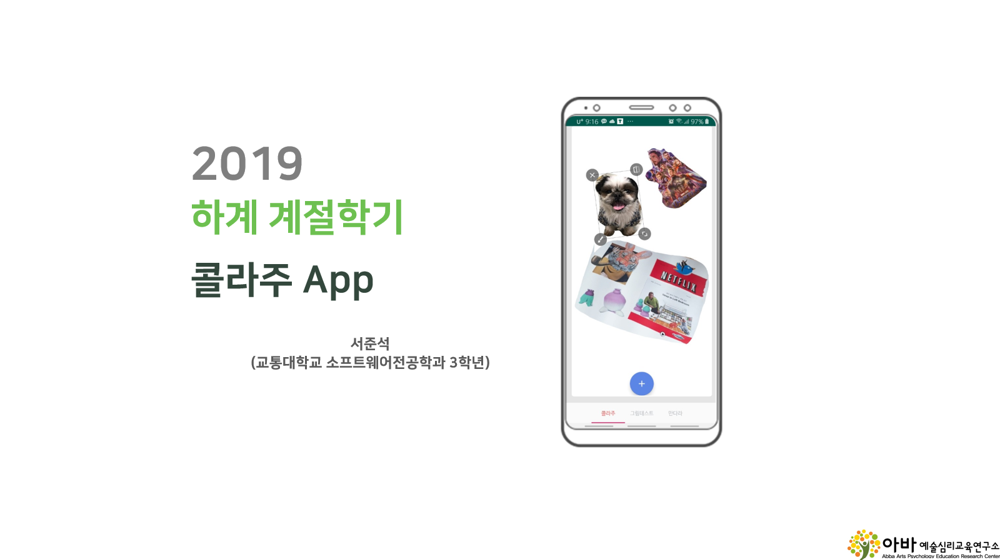
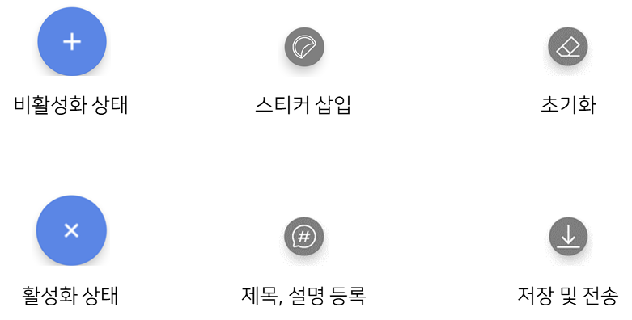
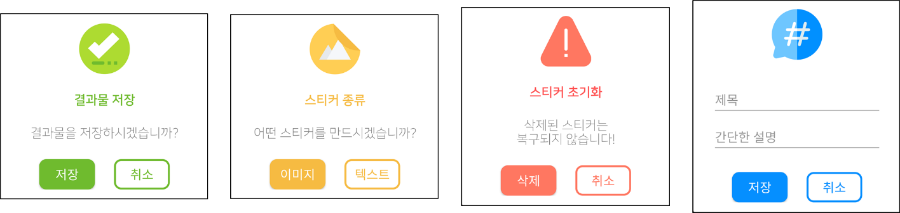
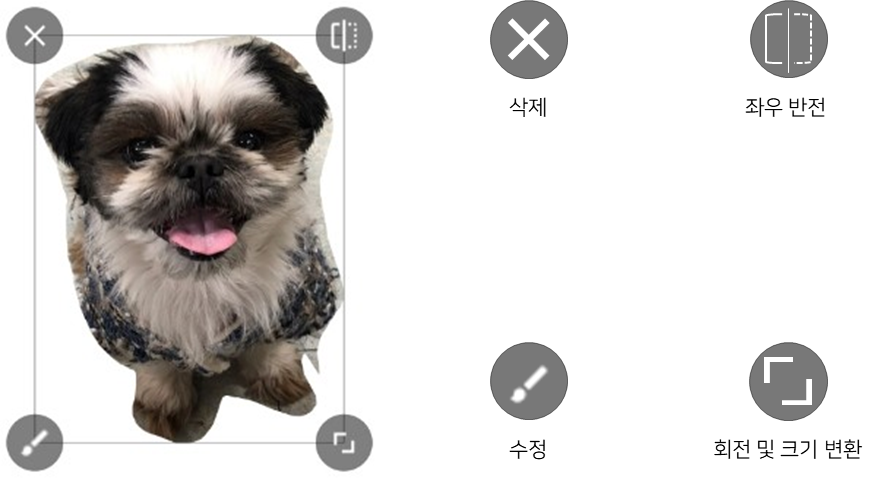
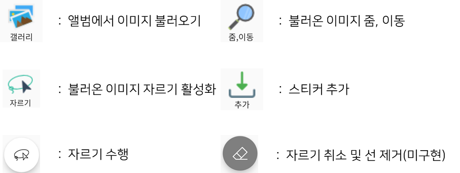
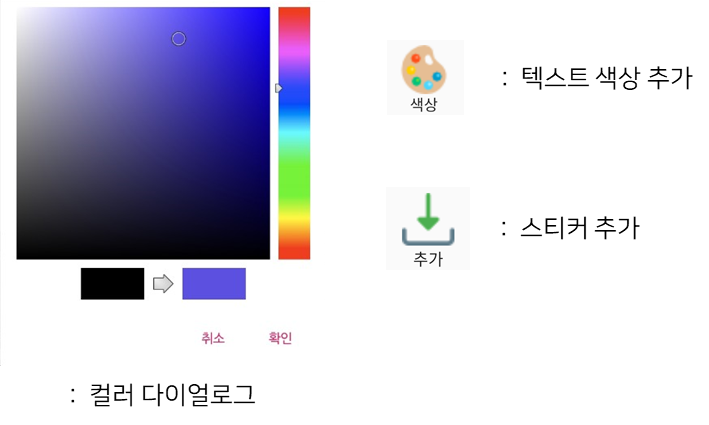
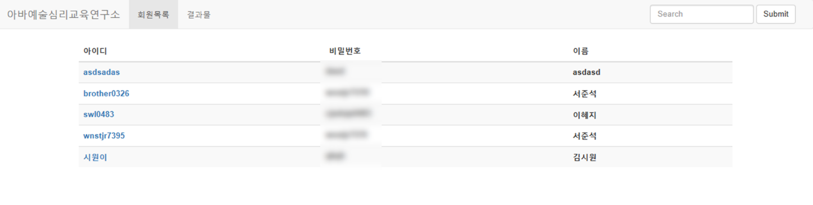
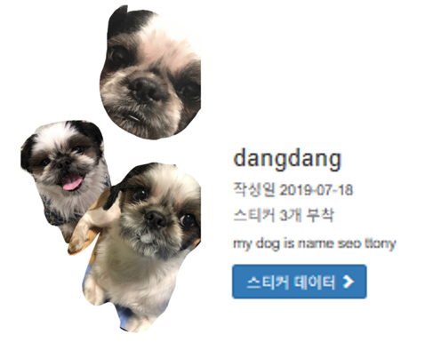
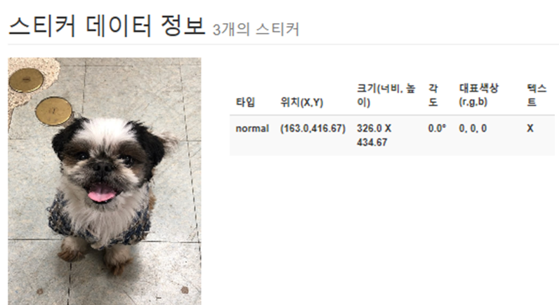

 
# 콜라주 App

1. 개발동기와 주제
 * 미술 치료는 미술 활동을 통해서 심리적인 어려움이나 문제를 표현하고 치료할 수
있도록 하는 활동이다. 
미술 치료에도 여러가지 기법이 존재하며, 그 중 콜라주[Collage]라는 미술 치료 기법을 알게 되었다. 
이 기법을 어플리케이션에 접목 시키면 미술 치료 활동을 온라인 상에서도 편리하게 이용할 수 있어서 좋을 것 같다는 생각이 들어 개발을 시작하게 되었다.

2. 소프트웨어 환경
    * 어플리케이션
      * 언어 : Java
      * 개발도구 : Android Studio
    * 관리자 페이지
      * 언어 : Java, HTML, CSS, Javascript
      * 개발도구 : Eclipse
    * 서버
      * 언어 : JSP
      * 개발도구 : Eclipse
    * 데이터베이스
      * MySQL
    * 버전 관리
      * Git
3. 기능
    * 회원 계정
    * 콜라주
      * 메인화면
        * 플로팅 액션 버튼  
        * 커스텀 다이얼로그  
      * 이미지 콜라주
        * 아이콘 버튼  
        * 이미지 편집  
        * 텍스트 편집  
      * 관리자 페이지
        * 회원 관리  
        * 회원별 결과물 조회  
        * 결과물 데이터 조회  
